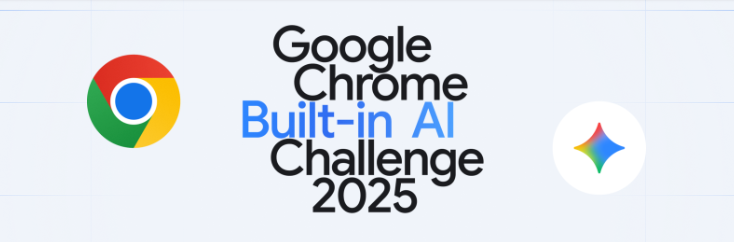

<table>
  <tr>
    <td></td>
    <td></td>
  </tr>
</table>


Ruhezeit — Chrome Extension (Manifest V3)

Ruhezeit is a small, modular Chrome extension written in vanilla JavaScript, HTML and CSS that helps you run distraction-free focus sessions and organize browser tabs. This repository is an MV3 extension scaffold built to demonstrate: tab organization, focus sessions with blocking rules, and optional integration with built-in Chrome AI APIs (when available).

This README documents the code layout, important files, the Chrome APIs used, how the UI flow works, and how to load the extension for local testing.

---

## Quick facts

- Platform: Chrome / Chromium-based browsers (Manifest V3)
- Tech: Vanilla JavaScript, HTML, CSS
- Key Chrome APIs used: `tabs`, `tabGroups`, `scripting`, `declarativeNetRequest`, `storage`, `commands`, `sidePanel` (optional)
- Optional built-in AI wrappers: Prompt, Summarizer, Writer, Translator, Language Detector (feature-detected at runtime)
- UI: toolbar popup and sidepanel; also an optional floating in-page panel injector (toggleable)

---

## Files and important locations

- `manifest.json` — MV3 manifest; lists permissions, commands and the `background` service worker.
- `background.js` — Service worker that manages tab organization, focus session lifecycle, DNR rules, and message handlers.
- `sidepanel.html` — Main interactive UI page; the welcome → setup → active → summary flow is implemented here.
- `sidepanel.js` — UI logic and message bridge; contains render functions for different views and uses `chrome.runtime.sendMessage` via a safe Promise wrapper.
- `popup.html` / `popup.js` — Toolbar popup; provides a compact welcome and a quick link to open the full sidepanel.
- `inject-floating-panel.js` — Content script used to inject a draggable dotted-box floating panel into the active tab (toggleable via the popup or keyboard shortcut).
- `src/` — Helper modules such as `focus-manager.js` and other small utilities.
- `styles/` — CSS files used by UI pages.
- `docs/README.md` — this file (usage & developer notes).

---

## User-facing flow (UI)

1. Open the extension from the toolbar (popup).
2. Click `Start Focus Session` (popup) or `Open Full Sidepanel` to open the interactive sidepanel.
3. Welcome → Timer selection (25 / 50 / 1 (test)) → Begin Focus.
4. Active timer view shows countdown and allows ending session early.
5. At session end a session summary screen is shown with: checkmark header, session stats (Duration, Tabs used, Distractions blocked), a `Session covered` line, and two CTA buttons: `Return to All Tabs` and `Start Another Session`.

Notes:
- The popup contains a compact version of the same centered dotted-box UI for quick-invocation.
- An optional in-page floating panel can be injected into the current tab; it remains present while interacting with the page and is draggable.

---

## Chrome permissions and manifest notes

The extension requires these permissions in `manifest.json`:

- `tabs` — query and create tabs
- `tabGroups` — create and update tab groups
- `storage` — persist focus session state and summaries
- `scripting` and `activeTab` — inject the floating panel into the active tab
- `declarativeNetRequest` — add/remove dynamic blocking rules during a focus session

Example excerpt (already in `manifest.json`):

```json
"permissions": [
  "tabs",
  "tabGroups",
  "storage",
  "activeTab",
  "scripting",
  "declarativeNetRequest"
],
"host_permissions": ["<all_urls>"]
```

Commands (keyboard shortcuts) are specified under `commands` in `manifest.json`. By default the project suggests:

- `Ctrl+Shift+Y` — organize tabs
- `Ctrl+Shift+U` — toggle focus session
- `Ctrl+Shift+K` — toggle floating panel

You can change these in Chrome's Extensions → Keyboard shortcuts.

---

## Built-in AI APIs (feature detection + fallbacks)

Ruhezeit includes small runtime wrappers that try to use Chrome built-in AI APIs when available and otherwise fall back to safe behavior. The wrappers are located in `src/*-api.js` and the generic adapter lives in `sidepanel.js` as `window.RuhezeitAPI`.

Available wrappers (if the browser supports them):
- Prompt API — for interactive prompts
- Summarizer — summarize session text/titles
- Writer — rewrite or produce session notes
- Translator — translate summaries
- Language Detector — detect language of input

Important: these built-in APIs are feature-detected at runtime. If a built-in API is not available, the extension uses a fallback (simple text concatenation or stub) and continues working without hard failures.

---

## Developer notes — how to run locally (load unpacked)

1. Open Chrome and go to `chrome://extensions`.
2. Enable **Developer mode** (top-right).
3. Click **Load unpacked** and select the project folder `CHROME8BUILTIN` (the folder containing `manifest.json`).
4. Reload the extension after edits.

Quick test steps:
- Click the extension icon → try the popup `Start Focus Session` or `Open Full Sidepanel`.
- In the sidepanel: Start a 1-minute test session (1 min option), let it finish and confirm the summary displays.
- Press the keyboard command (Ctrl+Shift+K) to toggle the floating panel on the active tab (if allowed on that page).

Troubleshooting:
- If the floating panel fails to inject on chrome:// pages or PDF viewer, that’s expected — those pages block content script injection.
- If you see "Unchecked runtime.lastError: The message port closed before a response was received", ensure your `sendMessage` calls check `chrome.runtime.lastError` (the project already includes `sendMessageAsync` wrapper in `sidepanel.js`).

---

## How data is stored and the process flow

Ruhezeit stores runtime state and session summaries in `chrome.storage.local` under keys used by the background service worker:

- `ruhezeit_focus_session` — the currently running focus session (start, minutes, ruleIds, tabsUsed, blocked)
- `ruhezeit_session_summaries` — array of saved session summaries (session metadata + generated summary)
- `ruhezeit_tokens` — optional tokens/settings saved in Settings view for AI wrappers

Process when starting a focus session (high-level):
1. UI requests tab organization (`organization:run`) via `chrome.runtime.sendMessage`.
2. Background groups tabs by domain (see `background.js` → `runTabOrganization()`), creating up to 3/5/7 groups based on tab count.
3. UI sends `focus:start` with minutes and blockList. Background persists `ruhezeit_focus_session` and adds DNR rules via `chrome.declarativeNetRequest.updateDynamicRules()`.
4. When session ends (timer expires or user stops), UI or background triggers `focus:stop`, background removes DNR rules and stores final session and attempts to create a summary (saves into `ruhezeit_session_summaries`).
5. Background broadcasts `focus:ended` and the sidepanel displays the review summary UI.

---

## Accessibility & Responsiveness

- UI pages use semantic headings and buttons with accessible text and role attributes where relevant.
- The centered box is responsive and scales down for narrow popups or smaller screens.
- Keyboard shortcuts are provided for power users; all interactive controls are reachable via keyboard in the sidepanel.

---

## Files to inspect (inlinks)

Open these to see the relevant code:

- `manifest.json`
- `background.js`
- `sidepanel.html`
- `sidepanel.js`
- `popup.html`
- `inject-floating-panel.js`
- `src/focus-manager.js`
- `styles/sidepanel.css`

---

## Wiring the popup Start button to start a session (no sidepanel)

If you want the toolbar popup's "Start Focus Session" button to start organization and a focus session immediately (without opening the full sidepanel UI), you can send background messages directly from the popup. Here's a minimal, safe pattern that checks for `chrome.runtime.lastError` and starts organization first, then starts focus:

```html
<script>
  document.getElementById('start-focus-popup').addEventListener('click', () => {
    // Start organization first
    try {
      chrome.runtime.sendMessage({ type: 'organization:run' }, (resp) => {
        if (chrome.runtime.lastError) {
          console.warn('organization:run failed', chrome.runtime.lastError);
          return;
        }
        // After organizing tabs, start the focus session (default 25 minutes)
        chrome.runtime.sendMessage({ type: 'focus:start', minutes: 25 }, (r2) => {
          if (chrome.runtime.lastError) console.warn('focus:start failed', chrome.runtime.lastError);
          // close the popup to return focus to the page
          try { window.close(); } catch (e) {}
        });
      });
    } catch (e) { console.warn('popup start error', e); }
  });
</script>
```

You can also use the project's `sendMessageAsync` Promise wrapper (defined in `sidepanel.js`) if you prefer async/await semantics; in the popup you'd need a small wrapper or duplicate similar safe handling.

---

## Contributing notes

- Keep changes small and focused. Prefer small utility functions in `src/` and avoid large framework additions — the project is intentionally vanilla JS.
- If you add new background message types, document them in `background.js` and update `sidepanel.js` to call them via `sendMessageAsync()`.

---

## License

MIT — see LICENSE (if you want me to add one I can create a basic `LICENSE` file).

---

If you'd like, I can:
- Add a short `README` section that documents how to wire the popup buttons to start a session without opening the sidepanel tab.
- Add a simple MIT LICENSE file.
- Add usage screenshots and small gifs to the `docs/` folder.
- Generate a minimal `package.json` if you want to track dev tooling (not required for this vanilla extension).

Which of those would you like next?
